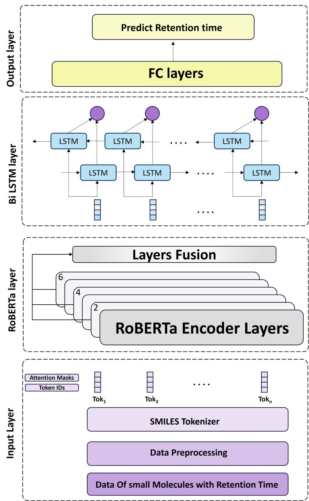

# Retention Time Prediction through SMILES Representation using a Hybrid Transformer-LSTM Model
This repository contains code and datasets for retention time (RT) prediction using SMILES representation and a hybrid Transformer-LSTM models that described in the preprint paper  [Prediction of chromatographic retention time of a small molecule from SMILES representation using a hybrid Transformer-LSTM model](). It includes scripts for training, evaluation, and visualization of results.

## Model Architectures

<!--  -->


## Project Structure

```
├── data
│   ├── METLIN-SMRT dataset and PredRet database and specific data training and testing files    
├── figures
│   ├── Various plots and result visualizations
│
├── models
│   ├── Pretrained and trained ChemBERTa models
│
├── net
│   ├── net.py (Neural network architecture)
│
├── notebooks
│   ├── Jupyter notebooks for data analysis and predictions
│
├── utils
│   ├── Helper scripts for training, evaluation, and visualization
│
├── train.py (Main training script)
├── train.sh (Shell script for running training)
├── lr_finder.py (Learning rate finder script)
├── requirements.txt (List of dependencies)
└── README.md (Project documentation)
```

## Data Sources
- The METLIN-SMRT dataset can be downloaded from
  - [The METLIN small molecule dataset](https://figshare.com/articles/dataset/The_METLIN_small_molecule_dataset_for_machine_learning-based_retention_time_prediction/8038913)
- The target datasets from PredRet database can be downloaded from
  - [PredRet database](http://predret.org/)

## Installation

Clone the repository and install the required dependencies:

```bash
pip install -r requirements.txt
```

## Usage

### Train the Model

Run the training script:

```bash
python train.py --model name_of_model --path /path/to/save
```

### Evaluate and Visualize Results

Use Jupyter notebooks in the `notebooks/` directory for analysis and visualization.

```bash
jupyter notebook notebooks/predict.ipynb
```

## Citation
If you use this repository in your research, please cite the original dataset sources and relevant publications.

<!-- ```bibtex
@article{Sargol,
}
``` -->

## Acknowledgments
This work leverages ChemBERTa models for small molecule retention time  predictions. Contributions and datasets from related works have been utilized for model training and evaluation.

---


